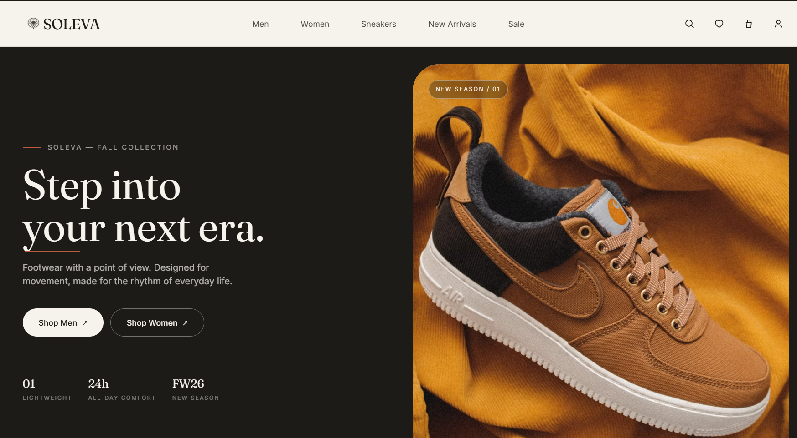

# SOLEVA

## Premium Footwear Storefront



SOLEVA is a polished, responsive e-commerce experience for a modern footwear brand. It combines editorial product storytelling with practical shopping flows, including filtering, product discovery, cart management, wishlist interactions, and a checkout prototype.

Built with React, TypeScript, Tailwind CSS, and React Router.

## Overview

The application is designed as a production-style frontend foundation rather than a connected commerce backend. It includes realistic product data, reusable UI primitives, responsive layouts, accessible overlays, and client-side shopping state so the full customer journey can be explored locally.

## Features

### Shopping experience

* Responsive homepage with hero content, category discovery, featured products, brand story, testimonials, and newsletter signup.
* Shop page with search, category, gender, price, size, color, and rating filters.
* Sorting controls, load-more pagination, loading skeletons, and an empty-results state.
* Product detail pages with image gallery, zoom, color and size selection, quantity controls, specifications, reviews, and related products.

### Cart and customer actions

* Slide-in cart drawer and dedicated cart page.
* Quantity updates, item removal, subtotal calculation, and order summary.
* Promo code support with the demo code `SOLEVA10`.
* Wishlist page with add/remove interactions.
* Checkout form with order confirmation state.
* Toast feedback for important actions.

### Quality and accessibility

* Keyboard-friendly dialogs and drawers.
* Visible focus states for interactive controls.
* Responsive navigation with a dedicated mobile menu.
* Reduced-motion support through `prefers-reduced-motion`.
* Layout safeguards for small screens, safe-area insets, and horizontal overflow.

## Tech Stack

* React 18
* TypeScript
* Vite
* Tailwind CSS
* React Router 6
* PostCSS and Autoprefixer
* ESLint

## Screenshots

### Homepage


## Getting Started

### Requirements

* Node.js 18 or newer
* npm 9 or newer

### Installation

```bash
git clone <repository-url>
cd soleva
npm install
```

### Start the Development Server

```bash
npm run dev
```

Open the local URL printed by Vite, usually `http://localhost:5173`.

## Available Scripts

| Command           | Purpose                                  |
| ----------------- | ---------------------------------------- |
| `npm run dev`     | Start the Vite development server        |
| `npm run build`   | Type-check and create a production build |
| `npm run preview` | Preview the production build locally     |
| `npm run lint`    | Run ESLint across the project            |

## Project Structure

```text
soleva/
├── public/
│   └── image.png
├── src/
│   ├── components/     Reusable UI components and storefront sections
│   ├── context/        Cart, wishlist, and toast state providers
│   ├── data/           Product catalog and local demo data
│   ├── pages/          Route-level page components
│   ├── App.tsx         Application shell and route configuration
│   ├── index.css       Tailwind layers, theme utilities, and global styles
│   ├── main.tsx        React application entry point
│   └── types.ts        Shared TypeScript domain types
├── README.md
├── package.json
└── ...
```

## Application Routes

| Route            | Description                 |
| ---------------- | --------------------------- |
| `/`              | Homepage                    |
| `/shop`          | Product catalog and filters |
| `/product/:slug` | Product details             |
| `/cart`          | Full cart page              |
| `/wishlist`      | Saved products              |
| `/checkout`      | Checkout prototype          |

## Data and Production Notes

This repository currently uses local product data and client-side React context state:

* Product images are loaded from Unsplash URLs in `src/data/products.ts`.
* Cart, wishlist, and checkout state reset when the page is refreshed.
* The checkout flow is a frontend prototype and does not process real payments or orders.
* Replace the demo catalog with a product API or CMS before launch.
* Add authenticated persistence for carts and wishlists.
* Connect checkout to a trusted payment provider and server-side order system.
* Configure image hosting, environment variables, analytics, and error monitoring for deployment.

## Customization

* Update catalog content in `src/data/products.ts`.
* Adjust colors, typography, spacing, and motion in `tailwind.config.ts` and `src/index.css`.
* Add or modify pages in `src/pages/` and register routes in `src/App.tsx`.
* Extend shared interactions through the providers in `src/context/`.

## License

No license has been specified yet. Add a license file before distributing the project publicly.
